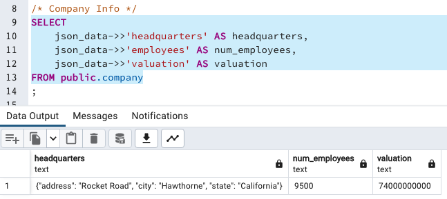
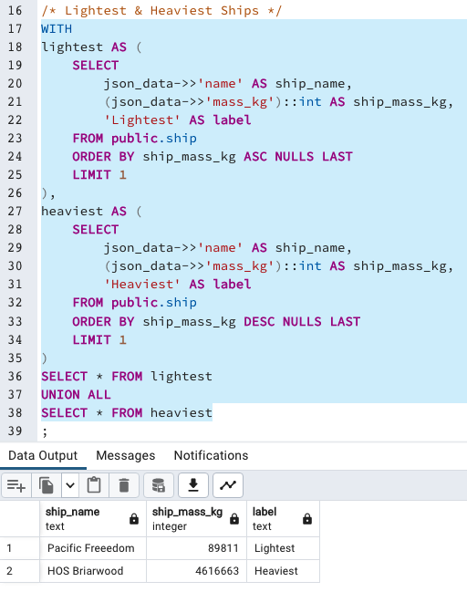
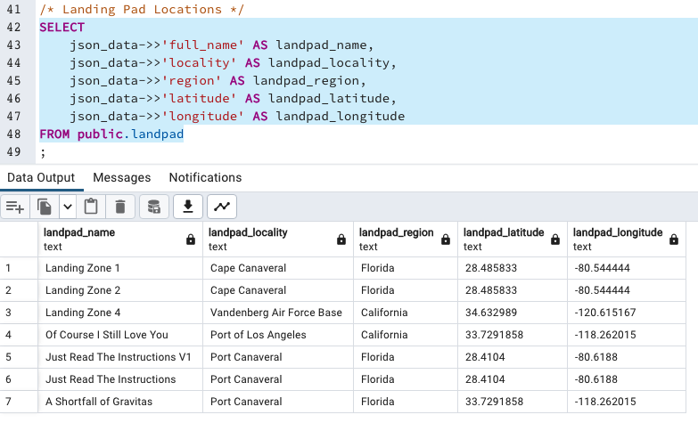

<!-- markdownlint-disable MD026 -->
# Welcome to Liru-DNA!

## What is this?

Fun little side-thing that let's me play around with the UNOFFICIAL [SpaceX REST API](https://github.com/r-spacex/SpaceX-API/blob/master/docs/README.md).

## How do I get started?

- First, ensure you have Docker installed.
- Create a GitHub account (if you don't have one already) and generate a Personal Access Token.
- Clone this repository, then save your token as `github_personal_access_token: <YOUR_TOKEN>` in a `secrets.yml` file at the root.
- Build the image via `docker build -t liru-dna .`.
- Run the test script with `docker run --rm -it --name spacex liru-dna:latest`.
- If you see "All tests passed :)", then you're set!

## Also works with Bazel!

- Install [Bazel](https://bazel.build/install) (if you don't have it already).
- Then just run

    ```bash
    bazel sync
    bazel test //:unit_tests
    ```

- You should see an output like this

    ```plaintext
    INFO: Analyzed target //:unit_tests (97 packages loaded, 1028 targets configured).
    INFO: Found 1 test target...
    Target //:unit_tests up-to-date:
    bazel-bin/unit_tests
    INFO: Elapsed time: 65.650s, Critical Path: 62.68s
    INFO: 7 processes: 5 internal, 2 darwin-sandbox.
    INFO: Build completed successfully, 7 total actions
    //:unit_tests                                                            PASSED in 61.3s

    Executed 1 out of 1 test: 1 test passes.
    ```

- The test script's print statements should now be available at `bazel-testlogs/unit_tests/test.log`.

## Cool! How about something more end-to-end?

- Assuming you've got the prerequisites setup, just run `docker-compose up`.
- Wait for `pg_ingest.py` to ingest sample data into a local PostgreSQL database.
- After it's done, connect to the DB using your query/data visualizer of choice. Mine's pgAdmin!
- I've defaulted the DB password to "postgres". Very secure, I know 😅

## What are some business questions we can answer with this?

### How about some basic company info?



### What are the lightest and heaviest spaceships?



### Where are the landing pads located?



### __Obviously, we'd want to do some proper data modeling before running any serious analysis. But hopefully you get the picture!__
